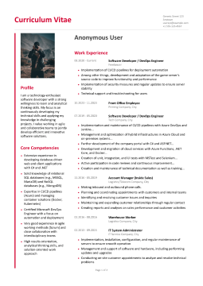
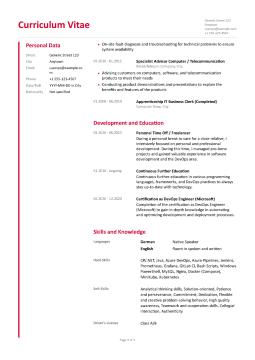

# CvPdfGenerator
A .NET application to generate a professional-looking CV/Resume PDF from structured JSON data, utilizing the excellent QuestPDF library. This project demonstrates creating complex, multi-column document layouts based on external data.

## Overview

This project takes CV data defined in a simple JSON file (`cv_data.json`) and uses QuestPDF to render it into a polished, multi-page PDF document. It replicates a common two-column CV layout, separating contact/personal details and skills from work experience and education.

The primary goal is to showcase how to structure data for document generation and implement the corresponding layout logic using QuestPDF in C#.

## Example ([cv-example.pdf](docs/cv-example.pdf))



## Features

* Generates multi-page CV PDFs from JSON data.
* Implements a professional two-column layout.
* Renders sections for:
    * Header (Name, Contact Info)
    * Profile Summary
    * Core Competencies
    * Personal Data
    * Attachments
    * Work Experience (with responsibilities)
    * Development and Education
    * Skills and Knowledge (Languages, Hard Skills, Soft Skills, Driver's License)
    * Footer (Page Numbers)
* Uses the [QuestPDF](https://www.questpdf.com/) library (Community License) for PDF creation.
* Uses the [QuestPDF Companion](https://www.questpdf.com/companion/usage.html) for PDF preview.

* Content is easily customizable by editing the `cv_data.json` file.
* Written entirely in English with thorough XML documentation comments, following strict coding standards.

## Prerequisites

* [.NET SDK](https://dotnet.microsoft.com/download) (Version 9.0 or later recommended)
* (Optional) An IDE like Visual Studio 2022, JetBrains Rider, or Visual Studio Code.

## Getting Started

1.  **Clone the repository:**
    ```bash
    git clone https://github.com/dennesneumann/CvPdfGenerator.git
    cd CvPdfGenerator
    ```

2.  **Prepare Data and Assets:**
    * Edit the `cv_data.json` file located in the main project directory (e.g., `src/CvPdfGenerator/`). Fill it with your actual CV information.
    * **Profile Picture:** Update the `ProfilePicturePath` value within `cv_data.json`. You can use:
        * A relative path (e.g., `.\\profile_picture.jpg`). If using a relative path, ensure the image file is copied to the application's output directory during the build. In Visual Studio, select the image file, go to Properties, and set "Copy to Output Directory" to "Copy if newer".
        * An absolute path (e.g., `C:\\Users\\YourName\\Pictures\\profile_picture.jpg`).
    * **JSON to Output:** Ensure the `cv_data.json` file itself is also copied to the output directory. In Visual Studio, select the file, go to Properties, and set "Copy to Output Directory" to "Copy if newer".

3.  **Run the application:**
    ```bash
    # Navigate to the main source directory if you aren't already there
    cd src/CvPdfGenerator

    # Run the project (adjust the path to your .csproj file if needed)
    dotnet run --project src/CvPdfGenerator/CvPdfGenerator.csproj
    ```

    * If running in `Debug` mode (default with `dotnet run`), the PDF should open in the QuestPDF Previewer tool.
    * If running in `Release` mode (`dotnet run -c Release ...`), a PDF file (e.g., `Curriculum_Vitae.pdf`) will be generated in the output directory (e.g., `src/CvPdfGenerator/bin/Release/net9.0/`).

## Data Customization (`cv_data.json`)

The entire content of the generated CV originates from the `cv_data.json` file.

* **Location:** The application expects to find `cv_data.json` in the same directory as the executable file at runtime. Make sure it's configured to be copied to the output directory during the build process.
* **Structure:** The JSON structure strictly follows the C# classes defined in the `CvPdfGenerator.Data` namespace (e.g., `CvData`, `CvWorkExperienceItem`, `CvDevelopmentItem`, etc.). Refer to these classes for details on available fields.
* **Editing:** Open `cv_data.json` in a text editor and modify the values for properties like `FullName`, `ProfileSummary`, `WorkExperience` items, `HardSkills`, etc., to match your details.
* **Optional Fields:** Some fields in the C# models are nullable (e.g., `DateRange` or `Details` in `CvDevelopmentItem`). If you omit these from the JSON or set them to `null`, the rendering logic should handle their absence gracefully. Required fields (marked with `required` in C#) must be present in the JSON file.

## Technologies Used

* [.NET 9.0](https://dotnet.microsoft.com/)
* [C#](https://docs.microsoft.com/en-us/dotnet/csharp/)
* [QuestPDF](https://www.questpdf.com/) (using Community License)
* [QuestPDF Companion](https://www.questpdf.com/companion/usage.html)
* [System.Text.Json](https://docs.microsoft.com/en-us/dotnet/standard/serialization/system-text-json-overview)

## Project Structure
```
├── .gitignore
├── src/
│   └── CvPdfGenerator/
│       ├── CvPdfGenerator.csproj # Project file
│       ├── cv_data.json    # CV data source file (set to copy to output)
│       ├── profile_picture.jpg # Example profile picture (set to copy to output)
│       ├── Data/
│       │   ├── CvData.cs
│       │   ├── CvDevelopmentItem.cs
│       │   ├── CvLanguageSkill.cs
│       │   ├── CvPersonalData.cs
│       │   └── CvWorkExperienceItem.cs
│       ├── Rendering/
│       │   └── CvDocument.cs
│       └── Program.cs
├── docs/
│   ├── cv-screenshot_1.png
│   └── cv-screenshot_2.png
├── LICENSE
└── README.md
```

## License

This project is licensed under the **GNU General Public License v3.0 (GPLv3)**.
- For full details, see the [LICENSE](LICENSE) file.
- Under the GPLv3 license, you are free to use, modify, and distribute this code, provided you:
  - Disclose the source code of any derivative works.
  - Include the original license and copyright notice.
  - Release derivative works under the same GPLv3 license.

## Contributing

Contributions, issues, and feature requests are welcome. Feel free to check [issues page](https://github.com/dennesneumann/CvPdfGenerator/issues) if you want to contribute.

## Acknowledgements

* Special thanks to the creators of the [QuestPDF](https://www.questpdf.com/) library.